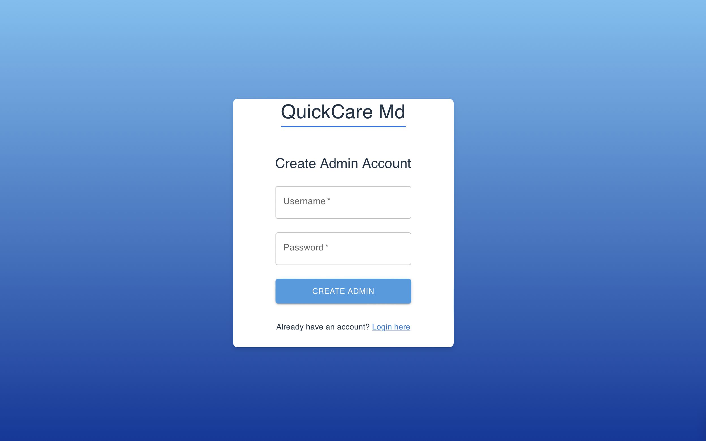

# QuickCare Md

QuickCareMD is a Django / React SPA walk-in medical app designed to enhance patient-doctor interactions and improve hospital workflow. With QuickCareMD, doctors can efficiently manage patient visits by viewing assigned patients, prescribing medication, and automatically removing treated patients from their dashboard (Discharging them) and sending the report to the Administration. The app also empowers hospital / administrators to manage the doctor roster, adding or removing doctors as needed to keep operations running smoothly. QuickCare ensures patients receive timely care while maintaining a seamless and organized experience for both medical professionals and hospital staff.

# Screenshot

# Attributions

# Technologies used

# Next Steps
- Impliment admin being able to hire nurses and assign them to a specific doctor
- An admin being able to evaluate the doctor's performance

# Deployed Link

